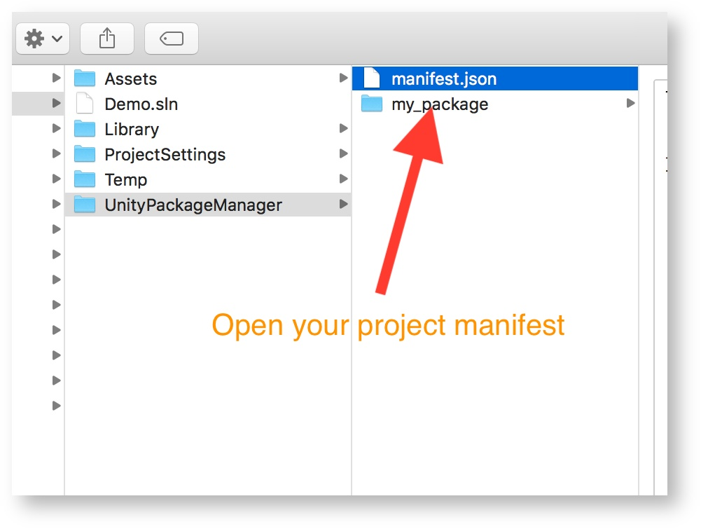

# Local Packages

## Introduction

> The local package feature is currently provided in its initial raw form. We plan to introduce the feature in the user interface and improve it over time. For example, users will have a button in the user interface to browse for the package location. We will add more error checking/reporting etc...

> Local dependencies are really intended to be development facilitators. We don't encourage committing local dependencies to source control if you share the project with other people, unless their local setup can be configured to be like yours (e.g., using simple relative paths, avoiding paths with usernames and avoiding absolute paths altogether because not portable). For a local-only project, or a private Git repo you don't share with others, local dependencies are fine.

## Availability

> Feature is available starting 2018.2. In 2018.1 and prior, local packages are read-only. This means, the asset database will not generate or update meta files.

### Step 1 - Locate and open the project manifest in a text editor



### Step 2 - Add the local package in the project manifest

> Use the file: version scheme to reference your package:

```json
{
  "dependencies": {
    "my_local_package": "file:/Users/pascall/Packages/my_local_package"
  }
}
```

> Windows (note the forward slashes)

```json
{
  "dependencies": {
    "my_local_package": "file:C:/Users/pascall/Packages/my_local_package"
  }
}
```

> You can set relative path to the project manifest. Example: "file:../Test/MyTestPackage"
